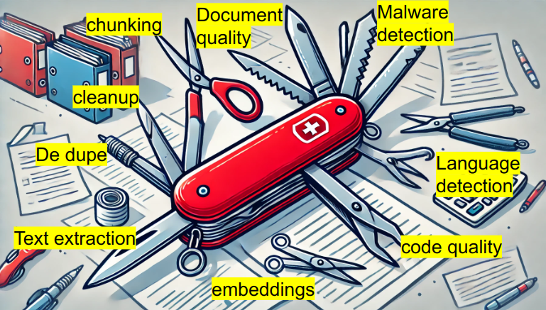

# Data Prep Kit Examples

## About

### bit.ly/dpk-examples

**Sujee Maniyam** (AI Engineer and Developer Advocate) 
sujee@node51.com  &nbsp; •  &nbsp; [Portfolio](https://sujee.dev/)

## Events

- [2025-02-13: AI Alliance Office hour - Workshop : RAG with Data Prep Kit + Milvus + Granite](events/2025-02-13__AI-alliance-office-hour-RAG-workshop.md)

- [2025-02-06: AI Alliance Office hour - Data Preparation with Data Prep Kit](events/2025-02-06__AI-alliance-office-hour-data-prep-kit.md)

- [2025-01-30: AI Alliance Office hour - Data Preparation with Docling](events/2025-01-30__AI-alliance-office-hour-docling.md)

- **[Data Prep Kit workshop - Latest](events/data-prep-kit-workshop.md)**

- [2024-10-21: Workshop @ IBM Tech XChange](events/2024-10-21__IBM-tech-xchange-workshop.md) , Las Vegas, NV

- [2024-09-21: Hands on RAG workshop @ Data Riders meetup](events/2024-09-21__RAG-workshop-data-riders.md) - Hacker Dojo, Mountain View, CA

- [2024-08-08: Open Source AI Demo Nigh, San Francisco, CA](events/2024-08-08__open-source-ai-demo-night.md)

## Introducing Data Prep Kit (DPK)

Whether you're performing RAG (Retrieval-Augmented Generation) or fine-tuning a model, a significant portion of your time will be dedicated to cleaning (de-duping, removing markups, etc.) and shaping the data.

[Data Prep Kit](https://github.com/IBM/data-prep-kit) can help you with wrangling data.  

Noteworthy  features:

- de-duping documents (exact dedupe and [fuzzy dedupe](https://github.com/IBM/data-prep-kit/tree/dev/transforms/universal/fdedup/ray#readme))
- can handle documents and code
- extract text from PDFs
- language detection (spoken languages and programming languages)
- malware detection
- [document quality checking](https://github.com/IBM/data-prep-kit/blob/dev/transforms/language/doc_quality/python/README.md)
- tokenizing and chunking
- generating embeddings

## Getting Ready

[Getting Ready](getting-ready.md) guide

## How to Run the Code

Some notebooks can be run on Google colab.

But it is recommended you setup local python dev environment.

[Instructions for setting up dev environment](setup-python-dev-env.md)

## Labs

### Data Prep Kit Examples

➡️ [Data prep kit demos](./dpk-intro/README.md) - Get to know data prep kit features

### Milvus - Vector Database

[Milvus](https://milvus.io/) is a popular vector database that is **open source**

➡️ [A quick start of Milvus](milvus/milvus_1_quick_start.ipynb) - Run an embedded milvus 

➡️ [Vector search of movie plots using Milvus](milvus/milvus_2_movie_search.ipynb) - load movie data, index it with embeddings, upload the data into milvus and run semantic queries

### RAG Pipeline

➡️ [End to end RAG](rag/README.md) 

