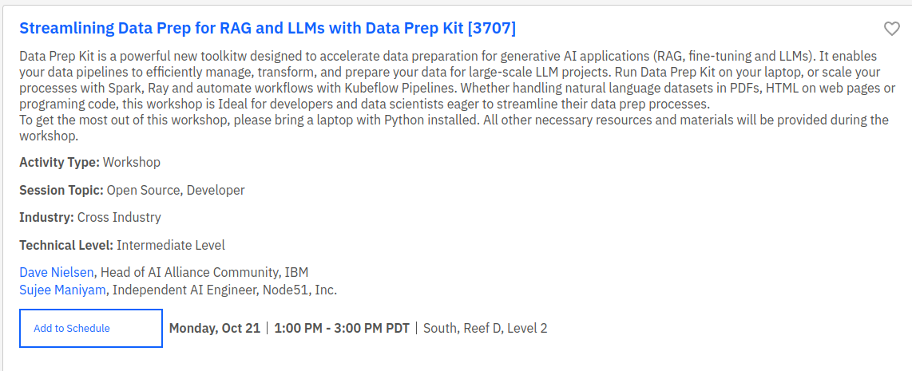

# 2024-10-21: Hands-on Workshop (IBM Tech Xchange, Las Vegas, NV)

## Event Details

[Event information](https://reg.tools.ibm.com/flow/ibm/techxchange24/sessioncatalog/page/sessioncatalog?search=3707&tab.sessioncatalogtabs=option_1601178495160)<br>
Date: Monday, October 21, 2024 <br>
Where:  Las Vegas, NV<br>

## 🔗  [bit.ly/3UirW42](https://bit.ly/3UirW42)


## Getting Ready for the Workshop

Here are the [getting-ready](../getting-ready.md) instructions.

Please try to complete as much as the setup **before attending** the workshop.

## Support and Community

For Data Prep Kit support,  discussions and feedback use [#data-prep-kit](https://discordapp.com/channels/1276554812359442504/1286046139921207476) channel on **Granite Community** server.  &nbsp;  |  &nbsp;  [invite](https://discord.gg/RjXrgDjA3b) 


## Code

**This repo (we will use it for the workshop)**

https://github.com/sujee/data-prep-kit-examples


```bash
git  clone  https://github.com/sujee/data-prep-kit-examples
```

**Data Prep Kit Repo**

https://github.com/IBM/data-prep-kit

```bash
git   clone   https://github.com/IBM/data-prep-kit
```

The examples are in `examples/notebooks` folder.


## Agenda


### 1. Data Prep Kit Feature Exploration

- [Workshop presentation slides](https://docs.google.com/presentation/d/1FyI7um71VcjYsFrcqyj5RHRgrrdsgGw30PPj6WptOQ4/edit?usp=sharing)

- [DPK feature walkthrough presentation](https://docs.google.com/presentation/d/1V3ODX4sCbXhci1EpU8aqC1sNJjMvHIn5DntWqWOQxh8/edit?usp=sharing)

- Code: [dpk-intro/dpk_intro_1_python.ipynb](../dpk-intro/dpk_intro_1_python.ipynb)  [](https://colab.research.google.com/github/sujee/data-prep-kit-examples/blob/main/dpk-intro/dpk_intro_1_python.ipynb)


### 2. RAG Pipeline with Data Prep Kit

[RAG/README.md](../rag/README.md)

## Links

### Speakers

**Speaker: Sujee Maniyam**  
AI Engineer / Developer Advocate (Consulting for [The AI Alliance](https://thealliance.ai/))  
**sujee@node51.com** &nbsp; • &nbsp; [Linkedin](https://www.linkedin.com/in/sujeemaniyam/) &nbsp;  • &nbsp;  [github](https://github.com/sujee/) &nbsp;  •  &nbsp; [Portfolio](https://sujee.github.io/portfolio/)  &nbsp;  •  &nbsp; [blog](https://sujee.dev/)

**Speaker: Dave Nielsen**<br>
Head of AI Alliance Commnuity, IBM<br>
[Linkedin](https://www.linkedin.com/in/dnielsen/)

