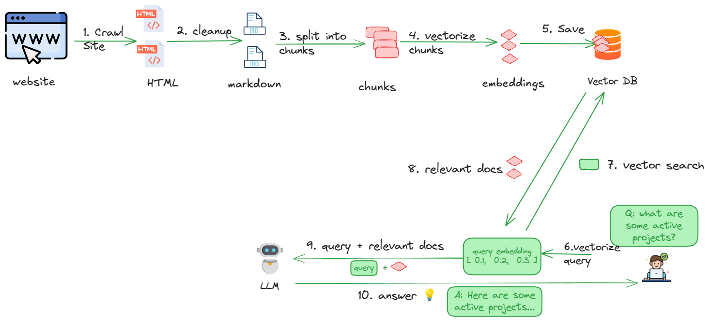

# Chat With AI Alliance Website

This example will show how to crawl a website, process HTML files and query them using RAG.

## Open Source Stack

1. Crawling the website: [Data Prep Kit Connector](https://github.com/data-prep-kit/data-prep-kit/blob/dev/data-connector-lib/doc/overview.md)
2. Processing HTML --> MD:  [Docling](https://github.com/docling-project/docling)
3. Processing MD (chunking, saving to vector db): [llama-index](https://docs.llamaindex.ai/en/stable/)
4. Embedding model: [ibm-granite/granite-embedding-30m-english](https://huggingface.co/ibm-granite/granite-embedding-30m-english)
5. Vector DB: [Milvus](https://milvus.io/)
6. LLM:  [IBM Granite](https://huggingface.co/ibm-granite)

## Workflow



## Step-1: Setup Python Env

```bash
conda create -n rag-website-1  python=3.11

conda activate rag-website-1
```

Install modules

```bash
pip install -r requirements.txt 
```


## Step-2: Configuration

Inspect configuration here: [my_config.py](my_config.py)

Here you can set:

- site to crawl
- how many files to download and crawl depth
- embedding model
- LLM to use

## Step-3: Crawl a website

This step will crawl a site and download HTML files in `input` directory

[1_crawl_site.ipynb](1_crawl_site.ipynb)

For large websites, it is recommended to run the python script as follows

```bash
python     1_crawl_site.py
```


## Step-4: Process HTML files

We will process downloaded HTML files and extract the text as markdown.  The output will be saved in the`output/2-markdown` directory in markdown format

[2_process_html.ipynb](2_process_html.ipynb)

## Step-5: Save data into DB

We will save the extracted text (markdown) into a vector database (Milvus)

[3_save_to_vector_db.ipynb](3_save_to_vector_db.ipynb)

## Step-6: Query documents

### 6.1 - Setup `.env` file with API Token

For this step, we will be using Replicate API service.  We need a Replicate API token for this step.

Follow these steps:

- Get a **free** account at [replicate](https://replicate.com/home)
- Use this [invite](https://replicate.com/invites/a8717bfe-2f3d-4a52-88ed-1356231cdf03) to add some credit  💰  to your Replicate account!
- Create an API token on Replicate dashboard

Once you have an API token, add it to the project like this:

- Copy the file `env.sample.txt` into `.env`  (note the dot in the beginning of the filename)
- Add your token to `REPLICATE_API_TOKEN` in the .env file.

### 6.2 - Query

Query documents using LLM

[4_query.ipynb](4_query.ipynb)

## 7 - Flask UI

```bash
python app.py
```

Go to url : http://localhost:5000

## 8 - Building Docker

To build docker

```bash
# Replace "USER" with your dockerhub username (e.g. 'sujee')
docker  build  -t USER/rag-aialliance-2-docling  .
# for example
docker  build  -t sujee/rag-aialliance-2-docling  .
```

Other docker options:

- ` --progress=plain`
- `--no-cache`


Publishing the docker image to the dockerhub

```bash
docker  login 

# tag the image to match dockerhub account
# docker image tag  rag-aialliance    USER/rag-aialliance

# push it
docker  push   USER/rag-aialliance-2-docling
# e.g.
docker  push   sujee/rag-aialliance-2-docling
```

## 9 - Running the Docker image


**Flask**

```bash
docker run -p 5000:5000 sujee/rag-aialliance-2-docling
```

Go to URL:  http://localhost:5000

